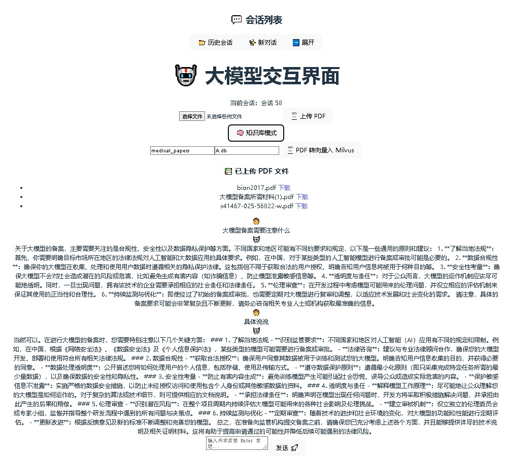
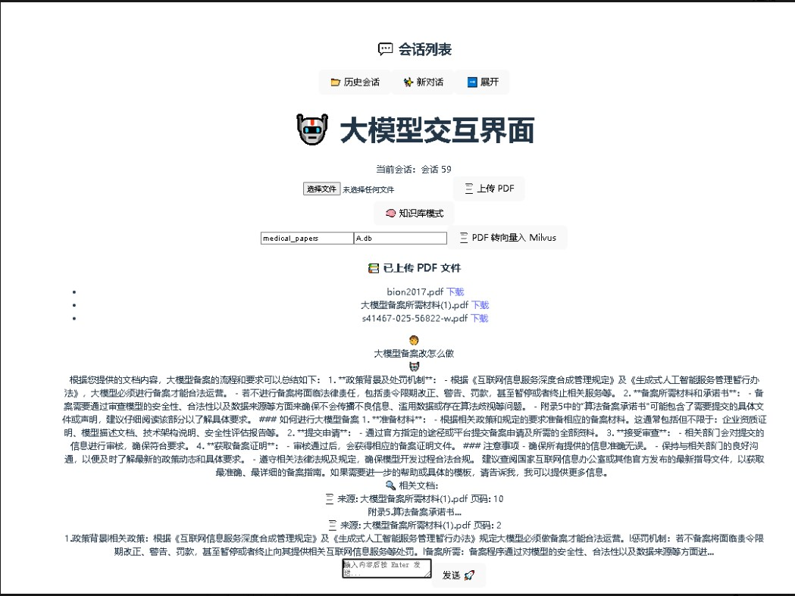

# 🩺 Medical Q&A System

本项目是一个基于 **RAG（Retrieval-Augmented Generation）** 的医疗智能问答系统，包含前后端两部分。  
系统可通过自然语言查询医学相关问题，并基于知识库提供精准回答。


🖼️ 系统界面展示

下图展示了项目的前端页面效果：

交互界面示例 1：



交互界面示例 2：




---

## 📂 项目结构

```
Medical_Q-A_system-main/
├── LICENSE
├── medical_system_back/         # 后端代码
│   └── rag_api/
│       ├── A.db                 # 数据库文件
│       ├── run.py               # 后端启动入口
│       ├── requirements.txt     # Python 依赖
│       └── app/
│           ├── main.py          # FastAPI 主程序
│           ├── config.py        # 配置文件
│           ├── db.py            # 数据库连接
│           ├── models.py        # 数据模型定义
│           ├── routers/         # 接口路由
│           │   ├── message.py   # 聊天记录接口
│           │   ├── session.py   # 会话管理接口
│           │   └── upload.py    # 文档上传接口
│           └── services/        # 服务逻辑层
│               ├── chat.py      # 聊天逻辑
│               ├── pdf.py       # PDF 文档解析
│               └── rag.py       # 检索增强生成 (RAG) 核心逻辑
│
└── medical_system_front/        # 前端代码 (Vue 3 + TypeScript)
    ├── src/
    │   ├── App.vue
    │   ├── main.ts
    │   └── assets/              # 图片与样式
    ├── index.html
    ├── package.json
    ├── tsconfig.json
    └── vite.config.ts
```

---

## 🚀 后端运行方式

### 1️⃣ 创建虚拟环境并安装依赖

```bash
cd medical_system_back/rag_api
python -m venv venv
source venv/bin/activate  # Windows 使用 venv\Scripts\activate
pip install -r requirements.txt
```

### 2️⃣ 启动 FastAPI 服务

```bash
python run.py
```

默认运行在：  
👉 `http://127.0.0.1:8000`

你也可以访问：  
- `http://127.0.0.1:8000/docs` 查看 Swagger API 文档。

---

## 💻 前端运行方式

```bash
cd medical_system_front
npm install
npm run dev
```

默认启动后访问：  
👉 `http://127.0.0.1:5173`

---

## 🔗 前后端联调说明

前端会通过 Axios 调用后端接口。  
在 `medical_system_front/src` 中可根据需要修改后端地址：

```ts
// 示例
const BASE_URL = "http://127.0.0.1:8000";
```

---

## 🧠 技术栈

### 后端
- FastAPI
- SQLite3
- RAG（Retrieval-Augmented Generation）
- LangChain / SentenceTransformer
- Pydantic
- Uvicorn

### 前端
- Vue 3
- TypeScript
- Vite
- Axios
- Tailwind / Element Plus（可选）

---

## 📘 项目亮点

✅ 支持多轮对话记忆：系统自动保存上下文，实现连续问答与上下文理解。
✅ RAG 检索增强生成：结合语义检索与大语言模型生成，实现更准确、更专业的医学回答。
✅ 本地知识库嵌入检索：支持医学资料（PDF/Word）导入，自动向量化后可用于知识问答。
✅ 快速数据库存取：基于 SQLite3，轻量稳定，适合嵌入式和小规模医疗项目。
✅ API 设计清晰：后端采用 FastAPI，接口层次分明，文档自动生成（Swagger / ReDoc）。
✅ 前后端完全分离：前端 Vue 3 + TypeScript，可独立部署与扩展。
✅ 模块化架构设计：服务层（services）独立封装核心逻辑，便于维护和复用。
✅ PDF 智能解析：系统支持 PDF 上传后自动提取文本内容并生成向量索引。
✅ 可视化界面友好：现代化 UI，支持实时问答展示、文件上传、历史会话回放。
✅ 易于部署与迁移：无外部依赖数据库，适合快速落地与二次开发。

---

## 📜 许可证

本项目遵循 MIT License。详情见 [LICENSE](LICENSE)。

---

## ✨ 作者信息

**Medical Q&A System Team**  
weidongli@hubu.stu.edu.cn
指导方向：医学知识问答系统、AI 交互设计、RAG 检索增强
特别感谢：开源社区的 FastAPI、Vue、Milvus 贡献者
